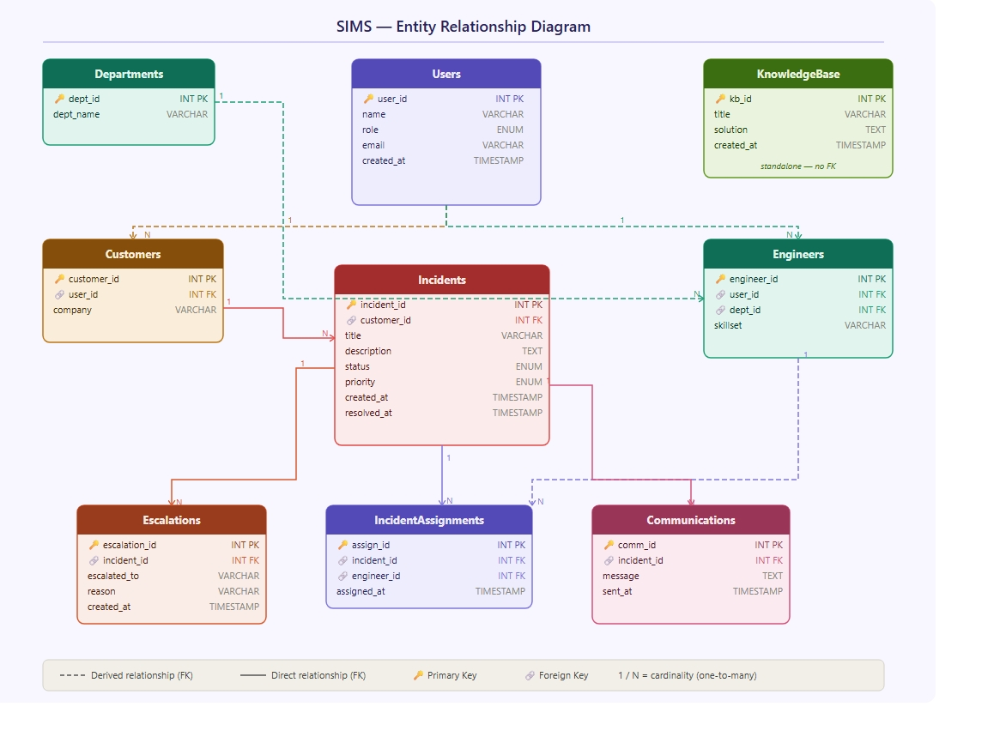

# 🛠️ SIMS — Support Incident Management System

A relational database project simulating a real-world **IT helpdesk / support ticketing system**. Designed to manage incidents, engineer assignments, SLA escalations, and customer communications across multiple support departments.

---

## 📌 Project Overview

SIMS models the backend data layer of an enterprise IT support platform. It captures the full lifecycle of a support ticket — from creation by a customer, assignment to a department engineer, escalation on SLA breach, resolution, and knowledge base archiving.

---

## 🗄️ Database Schema

The system is built on **9 relational tables** with enforced foreign key constraints:

| Table | Description |
|---|---|
| `Departments` | Five support departments (Network, App, DB, Security, Cloud) |
| `Users` | Base entity for all system actors — Customers, Engineers, Managers |
| `Customers` | Customers linked to Users; associated with a company |
| `Engineers` | Engineers linked to Users and assigned to a Department |
| `Incidents` | Support tickets raised by customers with priority and status tracking |
| `IncidentAssignments` | Maps incidents to responsible engineers |
| `Escalations` | Tracks SLA breach escalations sent to managers |
| `Communications` | Customer-facing updates tied to an incident |
| `KnowledgeBase` | Repository of resolved issue solutions for future reference |



### Entity Relationship Summary

```
Users ──┬── Customers ── Incidents ──┬── IncidentAssignments ── Engineers ── Departments
        │                            ├── Escalations
        │                            └── Communications
        └── Engineers
```

---

## 📊 Dataset

The project includes a Python script (`sims_data.py`) that auto-generates a realistic dataset:

| Entity | Count |
|---|---|
| Departments | 5 |
| Users | 200 (mix of Customers, Engineers, Managers) |
| Customers | 100 |
| Engineers | 50 (spread across 5 departments) |
| Incidents | 1,000 |
| Incident Assignments | 500 |
| Escalations | 100 |
| Communications | 300 |
| Knowledge Base Articles | 50 |

**Incident types include:** VPN issues, email sync failures, password resets, software crashes, MFA errors, database timeouts, Microsoft 365 errors, and more.

**Priority levels:** Low · Medium · High · Critical

**Status lifecycle:** Open → In Progress → Resolved → Closed

---

## 🚀 Getting Started

### Prerequisites
- MySQL 8.0+ (or MariaDB)
- Python 3.x (to regenerate data)

### Setup

1. **Clone the repository**
   ```bash
   git clone https://github.com/your-username/sims.git
   cd sims
   ```

2. **Create the database and tables**
   ```sql
   CREATE DATABASE sims;
   USE sims;
   SOURCE schema.sql;
   ```

3. **Load the seed data**
   ```sql
   SOURCE sims_data.sql;
   ```

4. **(Optional) Regenerate data**
   ```bash
   python sims_data.py > sims_data.sql
   ```

---

## 🔍 Sample Queries

**Top 5 most frequent incident types:**
```sql
SELECT title, COUNT(*) AS total
FROM Incidents
GROUP BY title
ORDER BY total DESC
LIMIT 5;
```

**Incidents by priority breakdown:**
```sql
SELECT priority, COUNT(*) AS count
FROM Incidents
GROUP BY priority;
```

**Engineers with the most assigned incidents:**
```sql
SELECT u.name, COUNT(ia.incident_id) AS assigned
FROM IncidentAssignments ia
JOIN Engineers e ON ia.engineer_id = e.engineer_id
JOIN Users u ON e.user_id = u.user_id
GROUP BY u.name
ORDER BY assigned DESC
LIMIT 10;
```

**All escalated incidents with their status:**
```sql
SELECT i.incident_id, i.title, i.status, e.reason
FROM Escalations e
JOIN Incidents i ON e.incident_id = i.incident_id;
```

---

## 📁 File Structure

```
sims/
├── schema.sql       # Table definitions with constraints
├── sims_data.sql    # Pre-generated seed data (2,300+ INSERT statements)
├── sims_data.py     # Python script to regenerate seed data
└── README.md
```

---

## 🧰 Tech Stack

- **Database:** MySQL
- **Scripting:** Python 3 (standard library — `random`, `datetime`)
- **Concepts:** Relational modelling, foreign key constraints, ENUM types, auto-increment PKs, normalized schema design

---

## 📄 License

This project is open source and available under the [MIT License](LICENSE).
